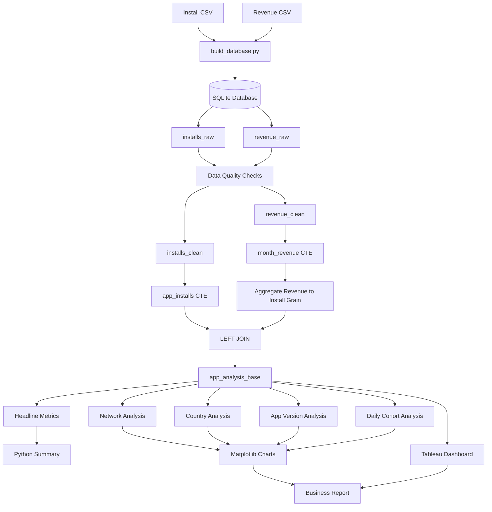
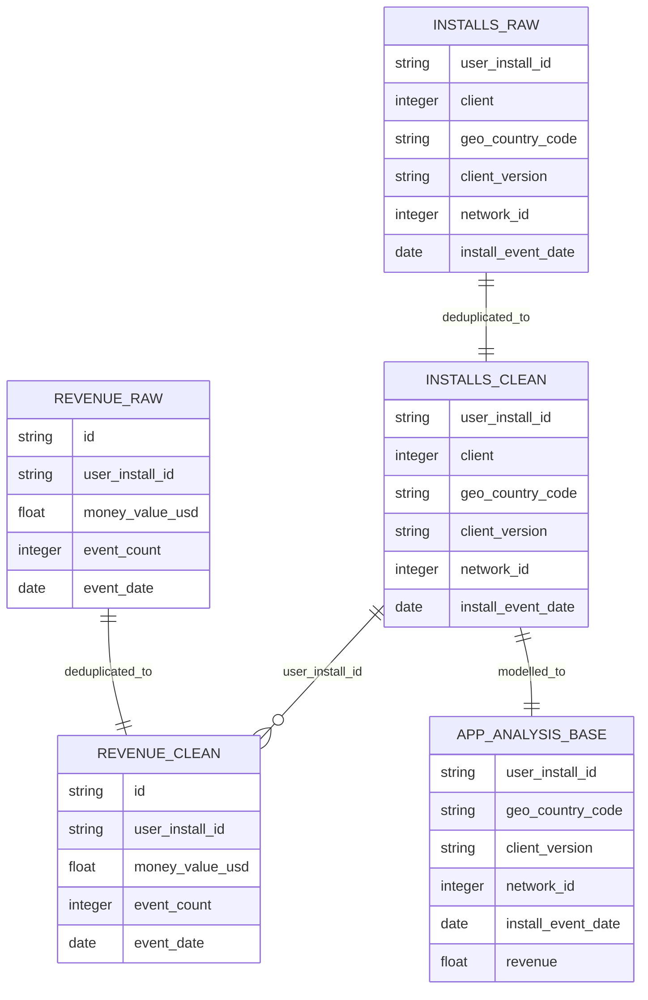
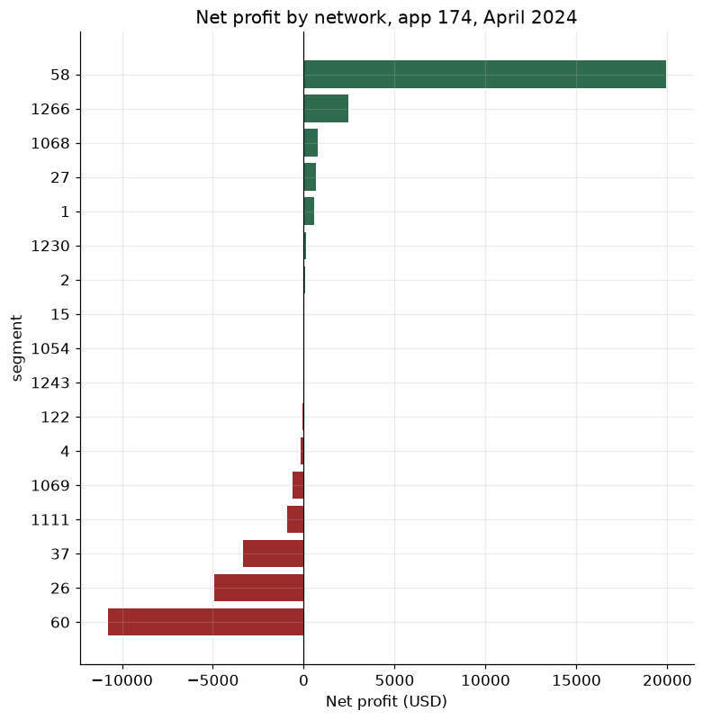
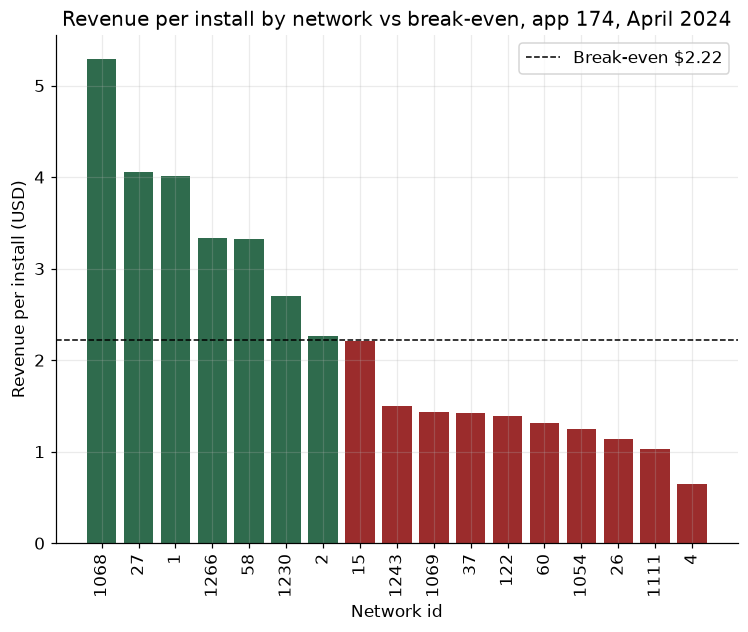
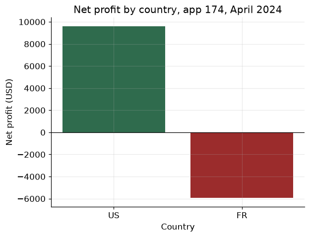
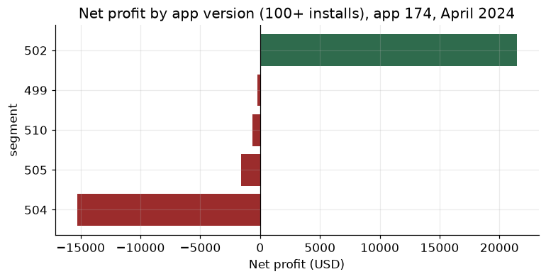

## Project architecture

The project follows a simple analytics-engineering workflow that separates ingestion, data validation, transformation, modelling, analysis, and presentation.



### Architecture layers

| Layer              | Purpose                                                                             |
| ------------------ | ----------------------------------------------------------------------------------- |
| Source layer       | Contains install-level and event-level CSV files                                    |
| Ingestion layer    | Loads and standardizes the source files with `build_database.py`                    |
| Raw layer          | Stores source-aligned tables in SQLite                                              |
| Validation layer   | Checks duplicates, missing keys, orphan records, date coverage, and event anomalies |
| Cleaning layer     | Produces one row per install and one row per revenue event                          |
| Modelling layer    | Aggregates revenue to install grain and creates the central analysis table          |
| Metrics layer      | Calculates profitability, ARPI, ARPPU, ROAS, ROI, and payer rate                    |
| Presentation layer | Produces charts, Tableau views, and business recommendations                        |

---

## Data flow

```text
Install CSV                     Revenue CSV
     |                               |
     +--------------+----------------+
                    |
                    v
             build_database.py
                    |
                    v
               SQLite database
                    |
          +---------+---------+
          |                   |
          v                   v
    installs_raw         revenue_raw
          |                   |
          v                   v
   installs_clean       revenue_clean
          |                   |
          |          aggregate by install ID
          |                   |
          +---------+---------+
                    |
                 LEFT JOIN
                    |
                    v
          app_analysis_base
          one row per install
                    |
        +-----------+------------+
        |           |            |
        v           v            v
     Metrics      Charts      Tableau
```

---

## Table relationships



---

## Data grain

The most important modelling decision was defining what one row represents in each table.

| Table               | Grain                                                                |
| ------------------- | -------------------------------------------------------------------- |
| `installs_raw`      | Intended one row per app install, with duplicate IDs present         |
| `revenue_raw`       | Intended one row per revenue event, with duplicate event IDs present |
| `installs_clean`    | One row per unique `user_install_id`                                 |
| `revenue_clean`     | One row per unique revenue-event `id`                                |
| `month_revenue`     | One row per install ID with aggregated monthly revenue               |
| `app_analysis_base` | One row per analysed install with total attributed revenue           |

Revenue is aggregated before the join because one installation can generate multiple revenue events.

---

## Data preview

### Install-level source data

Example structure:

| user_install_id | client | country | version | network_id | install_date |
| --------------- | -----: | ------- | ------: | ---------: | ------------ |
| install_001     |    174 | US      |     502 |         58 | 2024-04-03   |
| install_002     |    174 | FR      |     504 |         60 | 2024-04-24   |
| install_003     |    174 | US      |     502 |         58 | 2024-04-08   |

One row represents one app installation.

### Revenue-event source data

Example structure:

| event_id  | user_install_id | money_value_usd | event_count | event_date |
| --------- | --------------- | --------------: | ----------: | ---------- |
| event_001 | install_001     |            1.25 |           1 | 2024-04-04 |
| event_002 | install_001     |            2.10 |           1 | 2024-04-07 |
| event_003 | install_002     |            0.75 |           1 | 2024-04-25 |

One install may appear in multiple revenue-event rows.

### Final install-level analytical model

Example structure:

| user_install_id | country | version | network_id | install_date | revenue |
| --------------- | ------- | ------: | ---------: | ------------ | ------: |
| install_001     | US      |     502 |         58 | 2024-04-03   |    3.35 |
| install_002     | FR      |     504 |         60 | 2024-04-24   |    0.75 |
| install_003     | US      |     502 |         58 | 2024-04-08   |    0.00 |

The final model contains one row per install. Revenue events are summed before being joined to the installation record.

---

## Data transformation example

### Before aggregation

```text
Install ID: install_001

Revenue events:
$1.25
$2.10
$0.75
```

### After aggregation

```text
install_001 total revenue = $4.10
```

### Final model

```text
One install row
+
One aggregated revenue value
=
Safe profitability calculation
```

This prevents one installation from being counted multiple times.

---

## Dashboard preview

### Tableau overview

The dashboard presents:
* Headline profitability metrics
* Network-level profit contribution
* Revenue per install versus break-even
* Country comparison
* App-version performance
* Daily install cohort performance


### Network profitability



### Network ARPI versus break-even



### Country profitability



### App-version profitability



### Daily cohort performance


