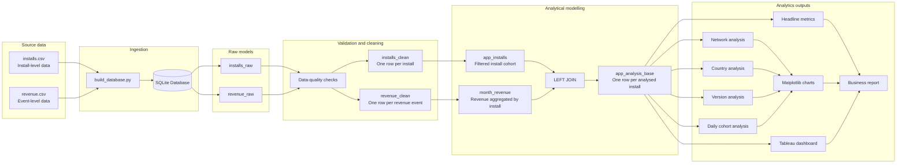
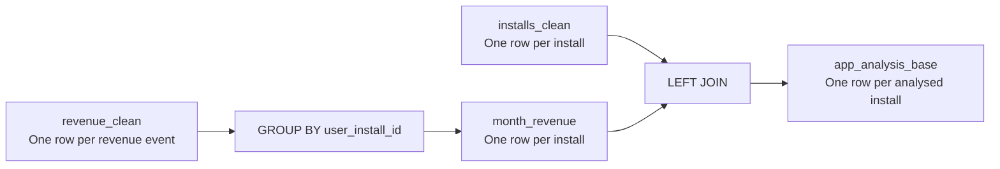
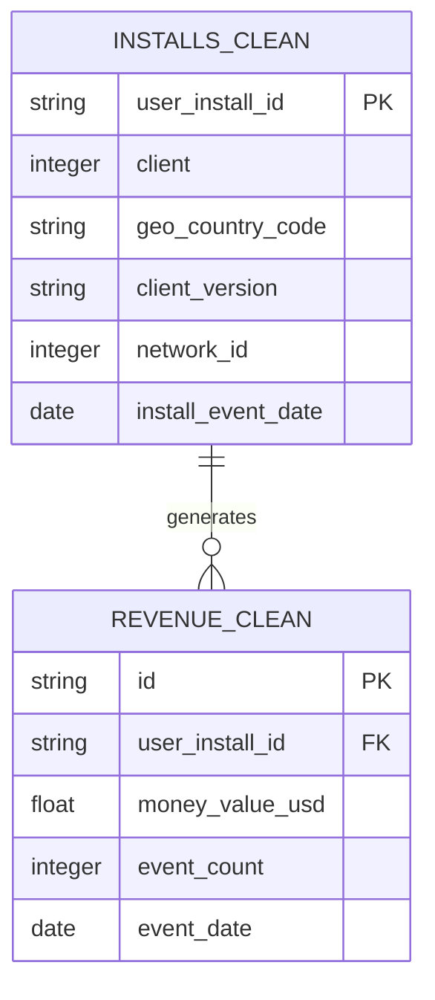
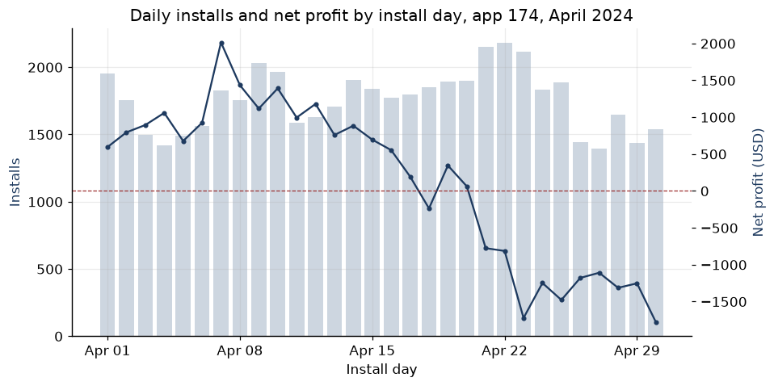

## Project architecture

The project follows a layered analytics-engineering workflow that separates ingestion, validation, cleaning, modelling, analysis, and presentation.



### Architecture layers

| Layer        | Purpose                                                                        |
| ------------ | ------------------------------------------------------------------------------ |
| Source       | Install-level and revenue-event CSV files                                      |
| Ingestion    | Loads and standardizes source files using `build_database.py`                  |
| Raw models   | Stores source-aligned data in SQLite                                           |
| Validation   | Checks duplicate keys, missing IDs, orphan records, dates, and event anomalies |
| Cleaning     | Creates one row per install and one row per unique revenue event               |
| Modelling    | Aggregates revenue to install grain and creates the central analytical table   |
| Metrics      | Calculates profitability, ARPI, ARPPU, ROAS, ROI, and payer rate               |
| Presentation | Produces Python charts, a Tableau dashboard, and business recommendations      |

---

## Core data model

The source tables have different grains:



One installation may generate zero, one, or many revenue events:



Revenue is aggregated before the join to prevent:

* Duplicate install counts
* Repeated acquisition costs
* Inflated segment volume
* Incorrect ARPI and profitability calculations

---

## Data grain

| Model               | Grain                                                                |
| ------------------- | -------------------------------------------------------------------- |
| `installs_raw`      | Intended one row per app install; duplicate IDs were present         |
| `revenue_raw`       | Intended one row per revenue event; duplicate event IDs were present |
| `installs_clean`    | One row per unique `user_install_id`                                 |
| `revenue_clean`     | One row per unique revenue-event `id`                                |
| `month_revenue`     | One row per install ID with aggregated monthly revenue               |
| `app_analysis_base` | One row per analysed install with total attributed revenue           |


---

## Synthetic data preview

The original source data is not included. The examples below are synthetic records that reproduce the project’s data structure.

### Install-level source data

| user_install_id | client | country | version | network_id | install_date |
| --------------- | -----: | ------- | ------: | ---------: | ------------ |
| install_001     |    174 | US      |     502 |         58 | 2024-04-03   |
| install_002     |    174 | FR      |     504 |         60 | 2024-04-24   |
| install_003     |    174 | US      |     502 |         58 | 2024-04-08   |

**Grain:** one row represents one app installation.

### Revenue-event source data

| event_id  | user_install_id | money_value_usd | event_count | event_date |
| --------- | --------------- | --------------: | ----------: | ---------- |
| event_001 | install_001     |            1.25 |           1 | 2024-04-04 |
| event_002 | install_001     |            2.10 |           1 | 2024-04-07 |
| event_003 | install_002     |            0.75 |           1 | 2024-04-25 |

**Grain:** one row represents one revenue event. One installation may appear in several rows.

### Final install-level analytical model

| user_install_id | country | version | network_id | install_date | revenue |
| --------------- | ------- | ------: | ---------: | ------------ | ------: |
| install_001     | US      |     502 |         58 | 2024-04-03   |    3.35 |
| install_002     | FR      |     504 |         60 | 2024-04-24   |    0.75 |
| install_003     | US      |     502 |         58 | 2024-04-08   |    0.00 |

**Grain:** one row per analysed installation, including installations with zero revenue.

---

## Transformation example

Before aggregation, one installation may have multiple revenue events:

```text
install_001
├── $1.25
├── $2.10
└── $0.75
```

After aggregation:

```text
install_001 total revenue = $4.10
```

Final model:

```text
One installation row
+
One aggregated revenue value
=
Correct acquisition and profitability calculations
```

---

## Tableau Dashboard preview

The Tableau dashboard presents:

* Headline profitability metrics
* Network-level profit contribution
* Revenue per install compared with break-even
* Country performance
* App-version performance
* Daily install-cohort performance

<p align="center">
  <a href="https://github.com/Noor-Ahmed-12/mobile-app-analytics-engineering/blob/main/tableau/App%20174%20Performance%20Overview.pdf">
    
  </a>
</p>

<p align="center">
  <em>Click the dashboard to open the complete PDF.</em>
</p>

---

## Key visualisations

<table>
  <tr>
    <td align="center" width="50%">
      
      <br>
      <strong>Network profitability</strong>
      <br>
      <sub>Shows which acquisition sources created or reduced total profit.</sub>
    </td>
    <td align="center" width="50%">
      
      <br>
      <strong>Network ARPI versus break-even</strong>
      <br>
      <sub>Compares network unit economics with the break-even threshold.</sub>
    </td>
  </tr>

  <tr>
    <td align="center" width="50%">
      
      <br>
      <strong>Country profitability</strong>
      <br>
      <sub>Highlights substantial monetisation differences between markets.</sub>
    </td>
    <td align="center" width="50%">
      
      <br>
      <strong>App-version profitability</strong>
      <br>
      <sub>Surfaces version-level performance and possible tracking issues.</sub>
    </td>
  </tr>
</table>

### Daily cohort performance

<p align="center">
  
</p>

<p align="center">
  <em>
    Late-month cohorts had less time to generate revenue, so their results
    should be interpreted with caution.
  </em>
</p>
